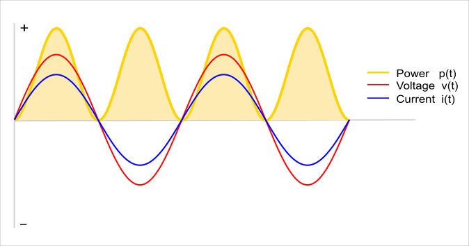
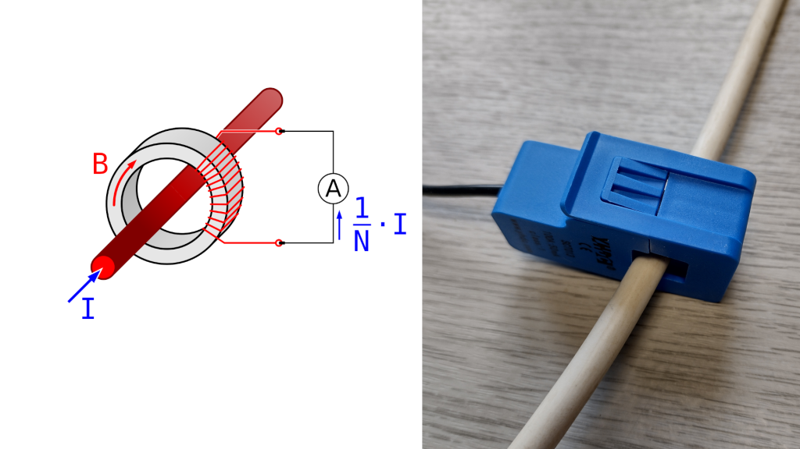
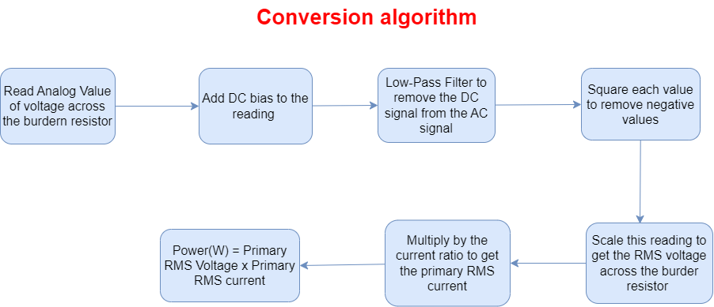

# power-energy-meter
prepaid-power-energy-meter

# Operation
## Background
For resistive loads like kettles, ovens and immersion heaters, the instantaneous power can be calculated using Ohm’s Law and is the product of instantaneous voltage and current; since both values are in phase, power is always positive.

The energy change for Alternating Current (AC) that is equivalent to Direct Current (DC) can be calculated by the Root Mean Square (RMS) of the current (Irms).

So the Real Power, which is what your electricity company charges you for, is the product of RMS voltage and RMS current:

Real Power = RMS Voltage x RMS Current*

## Current Transformers
Current transformers (CT) are a specialised type of transformer where the primary coil is the Line cable in your building wiring, and the secondary coil is connected in series with a low-value resistor called a Burden resistor. The small current flowing in the burden resistor generates a voltage across it which can be measured and used to calculate the current flowing in the primary circuit.

The CT we are using is rated at 100A, so it’s suitable for measuring the total power in a domestic home. It has 2000 turns : 1, so at its maximum primary current rating of 100A, it induces a 50mA secondary current:

100A / 2000 = 50mA

## Analog to Digital Conversion
Let's take for instance we are using an Arduino UNO, which has a 10-bit (0 – 1023) Analogue to Digital Converter (ADC) for measuring voltages between 0V and 5V. This gives a resolution of 4.9mV per division which is quite sensitive:

5000mV / 1024 = 4.88mV

The ADC can only measure voltages between 0V and 5V (it can be damaged if you exceed these limits), but the mains AC current alternates above and below zero, so the current in the burden resistor will do so in proportion.

If the signal is offset by a DC voltage at 2.5V (called DC biassing) the burden resistor can be sized such that the peak to peak (P2P) voltage is just below 5V, so we get the highest resolution and stay within the ADC tolerances.

Here is how the burden resistor is calculated for a 100A @ 50mA CT:

Primary P2P current = 100A rms x  = 100 x 1.414 = 141.1A

Secondary P2P current = Primary P2P current / Turns = 141.1 / 2000 = 70.7mA

Burden resistance = 2.5V / Secondary P2P current = 2.5V / 70.7mA x 1000 = 35.4 𝝮

33 Ω is the closest standard resistor size below, giving a margin of safety for the ADC and is sufficiently low to prevent the CT from saturating.

## Conversion algorithm
1. First we measure the voltage across the burder resistor by rapidly sampling the ADC to digitize the AC signal by filtering out the DC offset and calculating RMS current in the primary coil.

2. A FIXED value is used for the primary RMS voltage so the real power can be calculated along with the cost per KWh.

3. As stated above, the current ratio is set by dividing the current transformer's secondary coil with the burdern resistor value.

4. To DC bias the signal, we set the ADC at 512 (for arduio using 5V)

5. We then low-pass filter to remove the DC bias from the AC signal. This is simply donw by subtracting 512 from the ADC sampled value. If the ADC sampled value is >512, output is +ve, if the ADC sampled value is <512, output of filter is -ve.

6. Square each value from the filtered output to remove any negative values

7. Take the square root of the average reading and scale it by the Arduino supply voltage. This will give us the RMS voltage across the burden resistor. This is proportional to the primary current.

8. Multiply the RMS Voltage across the burder resitor by the current ratio to get the Primary RMS current

9. Multiply the PRIMARY RMS current by the PRIMARY RMS voltage to get the POWER in WATTS

10. From this, the cost per KWh can be calculated.

